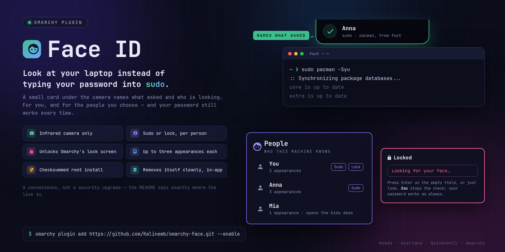

# Face ID

Look at your laptop instead of typing your password into `sudo` — for you, and for the
people you choose.

## What it is for

**Thirty passwords a day.** Updates, package installs, a file in `/etc`. With Face ID,
`sudo` shows a small card under the camera naming what asked, you glance at it, and the
command runs. Your password still works every time, and it is still what gets you past a
login screen or an SSH session.

**A family machine.** You and your partner both look after this laptop, so both of your
faces can approve `sudo`. Your kid is a person too — not for `sudo`, but so the Profiles
plugin can open their own desk when they sit down. Who can do what is a switch per
person, and only your password changes it.

**Glasses on, glasses off.** Every person has up to three appearances — no glasses,
everyday glasses, reading glasses — because an infrared camera sees those as different
faces.

**The lock screen, if you want it.** Off by default. Turn it on, lock, walk away; when
you come back, touch a key and look at the screen. Or press **Enter** on the empty
password field, any time, to ask for a face check there and then. The password field says
*Looking for your face…* while it checks, and tells you if it did not recognise you — so
you can see it working and decide whether to press Enter again or just type. It follows Omarchy's own
lock screen as it updates, and if an update changes too much it steps aside, tells you,
and your password works as always.



## What it is, and what it is not

**It is a convenience.** It saves typing and stops someone reading your password over
your shoulder. It is not a security upgrade.

**A face is always on.** A password has to be typed and a fingerprint has to be touched.
Your face is simply there. Any program running as you can start `sudo`, and if you are
in front of the camera your face can answer before you have read what asked. The card
names the command and what started it so you can notice a request you did not make —
noticing is all it can do. Such a program could already wait for you to type your
password; face unlock removes the wait, not the permission.

**The lock screen wakes to anything.** A key, a bump of the mouse — or a program running
as you — wakes the screen and starts one face check. Enter on the empty password field
starts one too, and so can a program running as you, the same way. If you are sitting
nearby, it can open.

**Giving someone Sudo gives them root.** Everyone on this laptop uses the same account.
When Anna's face approves `sudo`, Anna runs commands as the machine's owner. The switch
says so.

**Sudo keeps a better record than the lock screen.** Every `sudo` answered by a face is
written to the system journal *by root* — whose face it was, which appearance matched, the
command that asked and what it was started from — and so is every attempt that failed. The
lock screen is written by root too, but it is a smaller claim: the daemon records
`lock verify matched: <name>` when it recognises somebody, and since it also records the
reason when it does not, a run of refusals can be read back afterwards.

What root cannot say is that the screen opened. The daemon only ever learns that a face
matched; what was done with that answer is not its business and it never finds out. The
line saying the lock was opened is written by your own session — so that part, and only
that part, a program running as you could still fake or remove.

**Names are visible on this computer.** The list of people and their display names can be
read by every account on the machine. Faces cannot. So is the record of what was last
checked and who it matched — any account can ask "is Anna at the camera right now?" and
get an answer, and can read who last approved what.

**It is not Windows Hello.** There is no secure chip. The face data and the matching code
live on this computer's disk, and anyone with root can change what "your face" means.

**A good infrared photograph of you can fool it.** It refuses to run without an infrared
camera, because a normal webcam accepts a printed picture — but an infrared image of a
face is not impossible to make.

**Your password is never replaced.** If face does not recognise you in a few seconds, or
the lid is closed, or a call is using the camera, the password prompt appears as always.

## How it works

**The engine is howdy.** Face builds it for you: howdy and a CPU-only dlib, compiled from
the Arch User Repository at the two revisions this version of Face was tested against, and
installed with `pacman`. It takes several minutes and about half a gigabyte of disk while
it runs, and it keeps going if you close the panel or restart the shell.

**Face's own half is small and readable:** seven scripts in `/usr/local/bin`, two systemd
units, one polkit action, one configuration file. They are installed from this plugin
folder, under one password dialog, and removed the same way.

**`sudo`** is wired by adding one marked four-line block to `/etc/pam.d/sudo`. Nothing
else in that file is touched, turning the switch off takes the block back out, and the
file goes back byte for byte. There is at most one face attempt per `sudo` call — a
password retry does not re-open the camera — and at most six attempts a minute across
separate calls.

**The lock screen** is a second plugin, `graveklar.face-lock`, that holds no copy of
Omarchy's lock screen: it loads *Omarchy's own* lock code and adds a face check alongside
the password field and the fingerprint reader. It draws nothing of its own — nothing may
draw over a session-lock surface, and a plugin that tried would be defeating the one
guarantee a lock screen makes. What it does instead is write a line into Omarchy's own
password field, the same place Omarchy puts *Authentication failed*: *Looking for your
face…* while the camera is open, and *Face not recognised — use your password.* when it
was not you. Omarchy clears it the moment you start typing. If an Omarchy update renames
that field the line stops and face unlock carries on without it, never the other way
round. When Omarchy updates its lock screen, the new
one simply runs. If an update changes the names that loader depends on, face turns itself
off there and says why, and the lock screen keeps working exactly as Omarchy ships it.
Face is tried when the screen **wakes**, or when you press **Enter** on the empty password
field — never when you lock it, because locking the machine while you are still sitting
in front of it would otherwise undo itself.

Enter works through Hyprland rather than through Omarchy's password field, which a plugin
cannot reach. While the screen is locked, and only then, Face registers a Hyprland binding
on Enter that passes the key straight on to the password field and also tells Face it was
pressed. It is removed when the lock ends, and your own `bindings.lua` is never touched.
An Enter that submits a typed password is recognised as one and starts no face check.
If Enter ever stopped reaching the password field while locked, switch to a text console
(Ctrl+Alt+F2), log in, and remove the binding:
`hyprctl eval 'for _, b in ipairs(_G.omarchy_face_enter_binds or {}) do b:unbind() end'`.

**After an update, and at login,** Face checks itself and tells you if something stopped
working, rather than leaving you to find out at a lock screen. It puts two small hooks in
`~/.config/omarchy/hooks/` — `post-update.d/graveklar-face.hook` and
`post-boot.d/graveklar-face.hook` — which Omarchy runs during `omarchy update` and a
moment after you log in. They read the same status the Setup view shows, as you, without
the camera and without a password, and send one notification per new problem that opens
Face ID → Setup. During an update they also catch the three things updates break: a Python
upgrade the engine was not built for, an Omarchy lock screen that no longer fits Face
(before the restart that would switch face off on it), and the AUR step that is about to
rebuild howdy or dlib away from the revisions Face tested. Nothing is printed when all is
well. If the plugin is removed, each hook deletes itself the next time it runs.

**"Who is at the camera?"** is answered by a small root daemon on a socket in `/run`, for
callers that hold no privilege of their own: the Profiles plugin and the lock screen
loader. The socket is reachable by every local process on purpose; the daemon asks the
kernel who is on the other end and answers only this account. Nothing it says
authenticates anybody — `sudo` never goes near it.

**What is stored where.** The face data lives in howdy's own model files, readable only by
root, and it is not a photograph: it is a list of numbers, and no picture of you is kept.
Display names and appearance labels live in `/var/lib/omarchy-face/people.json`, which
every account on the machine can read.

## Installing it

```sh
omarchy plugin add https://github.com/Kalinewb/omarchy-face.git --enable
```

A face icon appears in the bar. Click it and work down Setup:

1. **Install Face's system files** — one password dialog. It says it wants to run
   `/bin/bash` as the super user, because Face's own helpers do not exist yet to ask with
   their own message; the panel warns you before the dialog appears. **Updating** those
   files later asks the same way, for the reason below.
2. **Build the face engine** — the howdy and dlib build above.
3. **Record your face** — People → Add person. The first person recorded on the machine is
   its owner.
4. **Give that person Sudo, or Lock screen, or both** — Person → the switches. This says
   *who may*; on its own it changes nothing.
5. **Settings → Face for sudo**, and **Lock screen** if you want it. This is the other
   half, and it is the one that wires the machine: until it is on, no face is tried
   anywhere, however many people have the permission.

Both halves are needed, and that is deliberate rather than a nuisance: the per-person
switch is a list of names, and the Settings switch is the one that edits
`/etc/pam.d/sudo`. Each screen says when the other is missing — Settings will not turn on
before somebody has the permission, and the Person page says when the machine-wide switch
is off.

You need an infrared camera (Face refuses to work without one), and an account that can
already administer this machine — Face never grants more than the owner's password already
grants.

**What root installs, and why updates ask as administrator.** The plugin folder is yours
to write, and so is it for any program running as you — including while that dialog is on
screen. So root does not install from it. It copies the ten system files into a directory
only root can write, checks every byte against a SHA-256 written into the installer text
you authorised, and installs only that checked copy; a file changed at any point before
the copy is refused and nothing is installed. The helpers already on the machine cannot
know a newer release's checksums, so an update has to come with its own authorised
installer, which is why it uses the administrator dialog rather than Face's own.

## The views

| | |
|---|---|
| **Setup** | one row per thing that has to be true, with the button that repairs it where a button can |
| **People** | who this machine knows, how many faces can approve `sudo`, and Add person |
| **Person** | their appearances, their Sudo and Lock screen switches, a **Test** button that asks "does it recognise you now?" and unlocks nothing, and Remove |
| **Settings** | the two places a face is accepted, why the lock screen is or is not active, and the way out |
| **Remove** | what would be taken off this machine, and the button that does it |

Every change to who Face knows, and to where a face is accepted, asks for the owner's
password: a face can never grant itself Sudo, because Face is deliberately not part of the
password dialog's own stack.

## If something goes wrong

**The lock screen does not react to your face.** Press **Enter** on the empty password
field and look at the camera: the field says *Looking for your face…*, the infrared light
comes on, and the screen opens about three seconds later. If it says
*Not recognised — Enter to retry*, the check ran and did not match; press Enter again.

Without Enter, the check starts when the screen **wakes**, so the screen has to go dark
before there is anything to wake: leave it alone for five seconds and let it black out. A
key other than Enter pressed while it is still lit does not start a check — it puts those
five seconds back to the beginning. If *Looking for your face…* never appears after Enter,
no check was started: see `journalctl --user -t quickshell` for a line saying Enter could
not be registered.

**Right after opening the lid, it says *Camera waking? Enter to retry*.** Some infrared
cameras take a few seconds to deliver pictures after the laptop resumes, and a check that
runs before then sees nothing. Face cannot tell that apart from a face it did not know, so
for fifteen seconds after a resume it says the camera may still be waking. Press Enter
again.

Your password works the whole time, and it is quicker than the check — so if you type it
straight away it wins, and the face result arrives too late and is thrown away. That is
not a fault, and with the line on screen you can now see it happen and wait a moment
instead. If the lid was closed, the camera was closed with it: open it and press a key.

**The infrared light flickers, or the check says the picture is too dark.** Many
infrared cameras fire their light on every other frame, so half of what the engine sees
is black; howdy's `dark_threshold` setting skips those frames, and Face leaves it at
howdy's default. If *every* frame is dark — `journalctl -t omarchy-face` keeps giving
"too dark" and the light next to the camera never glows — the emitter is not being
switched on at all. That is a firmware quirk on some laptops, and
[linux-enable-ir-emitter](https://github.com/EmixamPP/linux-enable-ir-emitter) (AUR
`linux-enable-ir-emitter`) is the community tool for it. Face does not install or
configure it.

**Setup says there is no infrared camera, and you have one.** Face looks for a camera
that names itself infrared, or failing that one whose formats are all greyscale — 8-bit
`GREY`, or 10- or 16-bit `Y10`/`Y16`, which are the ones the engine can read.
`v4l2-ctl --list-devices` and `v4l2-ctl -d /dev/videoN --list-formats` show what yours
offers. A camera that offers only formats such as `Y8I` or `Y12I` is refused, because the
engine would open it and never get a picture.

**You want to know what it actually did.** Every face check for the lock screen is
recorded by Face's root daemon, match or no, with the reason when it says no:

```sh
journalctl -t omarchy-face --since -10min
```

`lock verify matched: <name>` is a face it recognised. A line saying no gives the engine's
own reason — gave up, too dark, timed out. Nothing at all means no check was ever started,
which sends you back to the blanking rule above.

**The lock screen came back looking like Omarchy's own.** That is on purpose. If Face's
copy of the lock screen cannot run — after an Omarchy update, or a bad Face update — Face
steps aside within half a minute and Omarchy's lock screen takes over, with a notification
saying why. Nothing is lost: your password and fingerprint are unchanged, and Face ID →
Settings shows the reason.

**You are looking at a locked screen with nothing on it.** Give it thirty seconds without
touching anything: if Face's lock screen failed to start, the shell notices, hands the
screen back to Omarchy's own lock, and a password box appears by itself. If after a minute
there is still no password box, switch to a text console (Ctrl+Alt+F2), log in, and run
`omarchy restart shell` from there.

## For the Profiles plugin

Two calls, and they are the whole contract:

```sh
omarchy-face-identity list            # the names Face knows, one per line
omarchy-face-identity verify <name>   # exit 0 = that person is at the camera
```

Any non-zero exit means "not verified". Any person can be bound to a profile; they do not
need Sudo. Names never change, so a binding never silently retargets somebody else.

## Removing it

**Settings → Remove Face ID from this machine.** It lists what would go, asks for your
password once, removes Face's system files, the people, the PAM lines, the daemon and the
engine — and then, as its last step, deletes the two health hooks and both plugin folders, which is what closes the
panel and takes the button off the bar. There is a tick for keeping howdy and dlib
installed if you expect to come back.

Removing the plugin any other way leaves the system half working: face still answers
`sudo`, nothing dangles, and nothing is lost — but to take that half off as well, install
the plugin again and use Remove.

## Licence

MIT.
